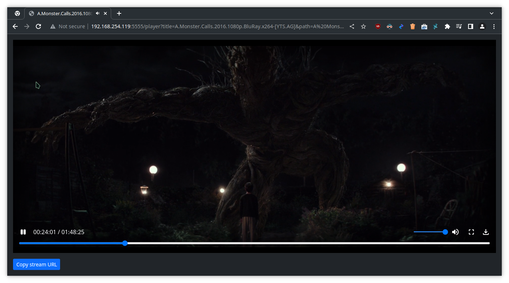
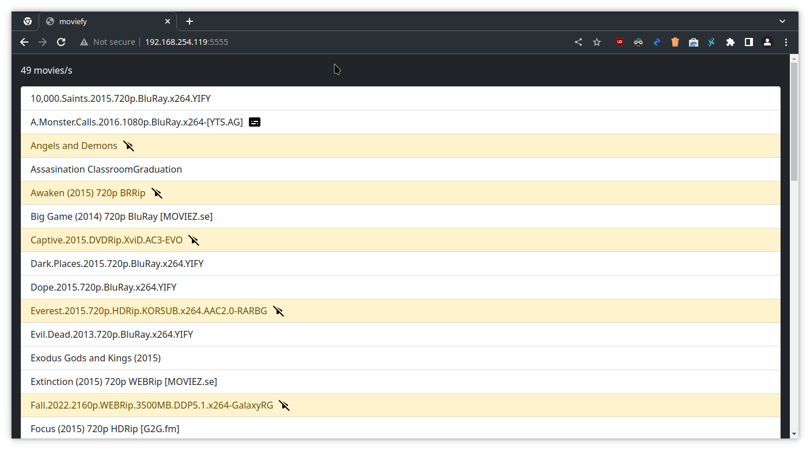
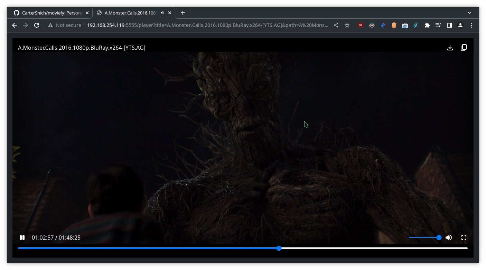

# moviefy



Personal movie website for sharing movies with all devices on my network. It uses [Fastify](https://www.fastify.io/) web framework and runs via [Node.js](https://nodejs.org/en/) for the web server and [Nunjucks](https://mozilla.github.io/nunjucks/) for templating.

It works offline, and movies can be downloaded or streamed on other media players like VLC or mpv.

## Setup

Make sure your movies are all stored in a folder. Your movies can be on the **root directory** or **inside another folder one level deep**, otherwise, it will not be found.

```
📂 movies
└── 🎞️ movie.mp4
└── 📂 Another the Movie
    └── 🎞️ another-movie.mp4
```

Then, create a symlink or shortcut of your movies folder inside `public` folder.

\*nix [(wth is this?!)](https://en.wikipedia.org/wiki/Unix-like#cite_ref-jargonfile_UNasteriskX_2-0):

```sh
ln -s 'absolute-path-to-your-movies' 'public/movies'
```

Windows:

```batch
# use bash
```

It should look like this:

<pre>
📂 moviefy
└── 📂 public
    └── 🔗 <i>movies</i>
</pre>

Softwares:

- Git (optional)
- Node.js >= 16.0.0 (do not use 17.0.0)

Clone the project and `cd` into it:

```sh
git clone
cd moviefy
```

Install all required `npm` packages:

```sh
npm install
```

Change this values in `server.js` file:

```js
const HOST = ""; // leave it blank to use current IP address.
// it will fallback to 127.0.0.1 if host computer is not connected to a network
const PORT = 5555; // port number
```

To run the server:

```sh
npm run serve
```

Or, to watch file changes (using nodemon):

```sh
npm run watch
```

## Screenshots

Movie selection


Player


## Dependencies

### Runtime

- @fastify/static ^6.5.1
- @fastify/view ^7.2.0
- fastify ^4.10.2
- fastify-qs ^4.0.1
- my-local-ip ^1.0.0
- nunjucks ^3.2.3

### Development

- nodemon ^2.0.20

## Issues

- Downloading the video makes the browser very laggy

## Plan for updates

- Support loading of subtitles
